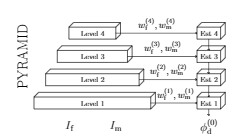
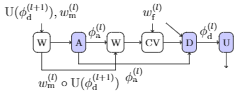

# learning-a-deformable-registration-pyramid
In this repository we show the implementation of a machine learning medical image registration method. The method was submitted to the [Learn2Reg 2020 Challenge](https://learn2reg.grand-challenge.org/). The method is based on 3D downsampled CNN pyramid wherein displacement fields are estimated and refined at each level.

## Environment
We are using Tensorflow 2.0.2. To install all necessary libaries run:
```
conda env create --file environment.yml
```

## Architecture

Our methods is inspired by [[PWC-Net]](https://arxiv.org/pdf/1709.02371.pdf), a 2D optical flow method popular in computer vision. Below is an overview of the architecture and a detail graph of the operations at each feature level. 

 

Description of the components:
- <strong>Pyramid:</strong> Downsamples the moving and fixed image into several feature map levels using CNN layers. The same pyramid is used for the moving and the fixed images.
- <strong>Warp (W):</strong> Warps features from moving images with the estimated displacement field.
- <strong>Affine (A):</strong> A dense neural network that estimates the 12 parameters in an affine transformation.
- <strong>Cost volume (CV):</strong> Correlation between the warped feature maps from the moving image and feature maps from the fixed image. For computational reasons the cost volume is restricted to the voxel neighbourhood.
- <strong>Deform (D):</strong> A CNN that estimates the displacement field based on the affine displacement field, the cost volume and the feature maps from the fixed image.
- <strong>Upsample (U):</strong> Upsamples the estimated displacement field from one level to the next.
\end{itemize}

## Result
TBD

## Dataset
see (https://learn2reg.grand-challenge.org/Datasets/) for instructions.

To run the traning and testing script we assuming the datasets are organized like this:

```
+-- task_02
|   +-- pairs_val.csv
|   +-- NIFTI
+-- task_02
|   +-- pairs_val.csv
|   +-- training
+-- task_03
|   +-- pairs_val.csv
|   +-- Training
+-- task_04
|   +-- pairs_val.csv
|   +-- Training
+-- Test
|    +-- task_01
     |    +-- pairs_val.csv
     |    +-- NIFTI
|    +-- task_02
     |   +-- Training
|    +-- task_03
     |   +-- Training
|    +-- task_04
     |   +-- Training
```
## Training
Train the model using images (and segmentations) for Task 2, 3 and 4 run
```
python train_model.py -ds {path to dataset root} -gpus 0,1,2
```

To fine tune the model on a specific task run:

```
python train_tf_task{TASK #}.py -ds {path to dataset root} -gpus 0,1,2
```

or feel free to modify, create your own training procedure

## Testing
Create submission

## Papers
TBD
